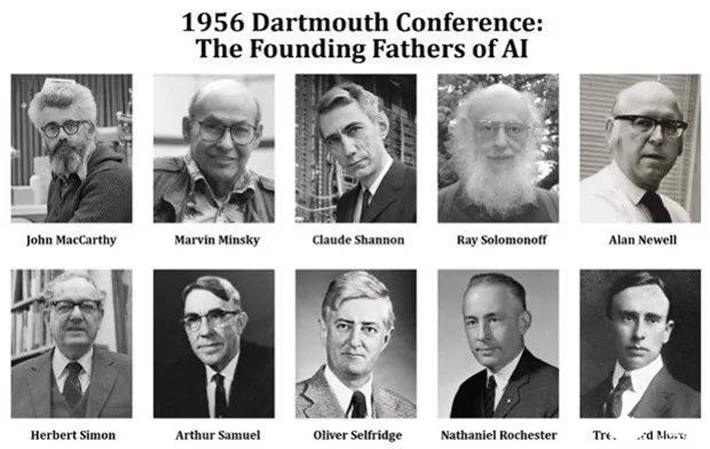
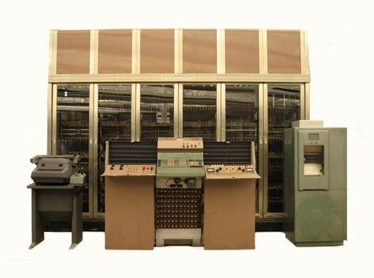
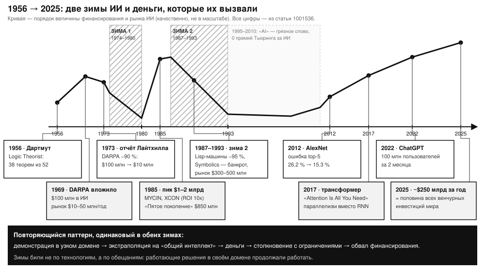
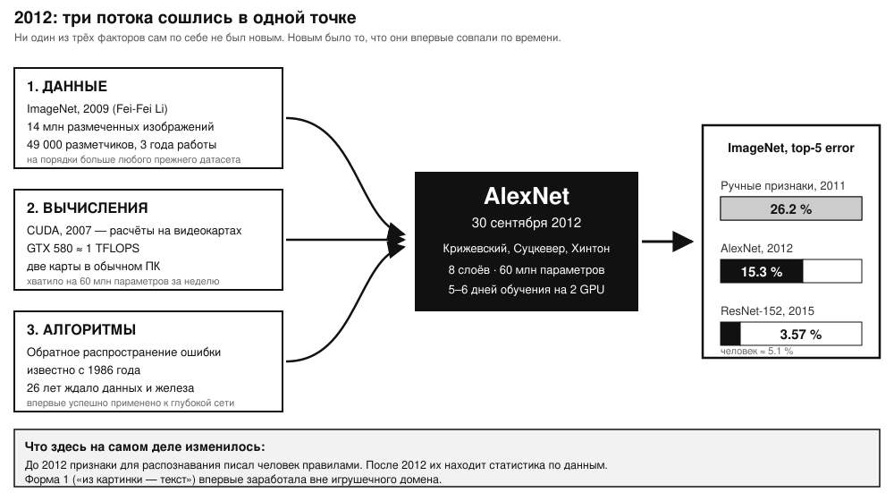
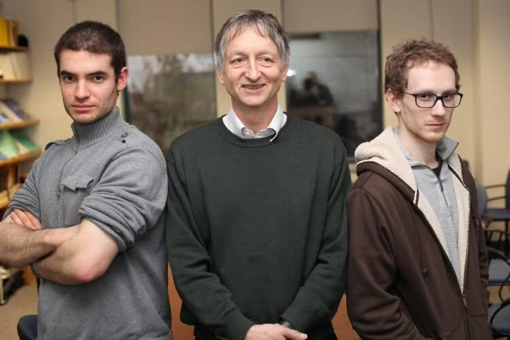
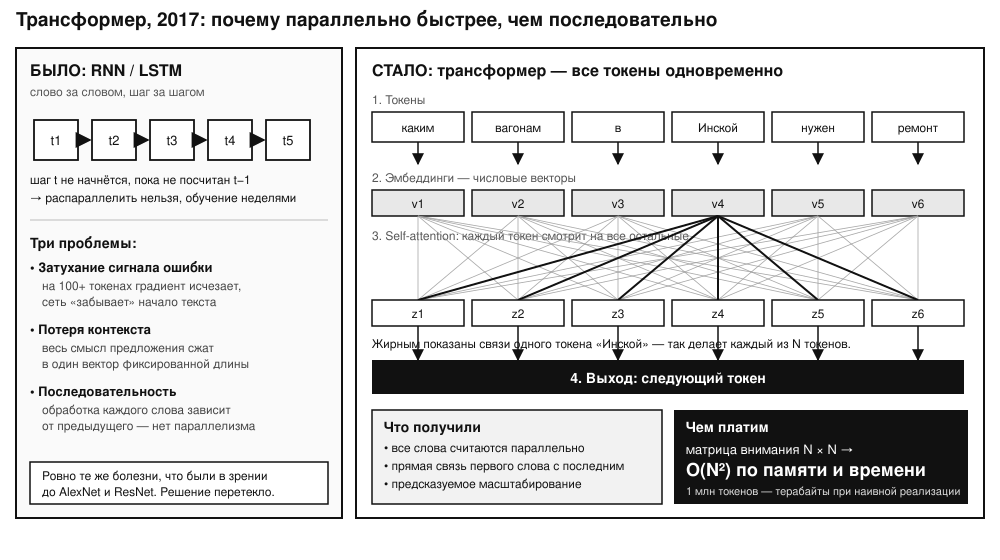
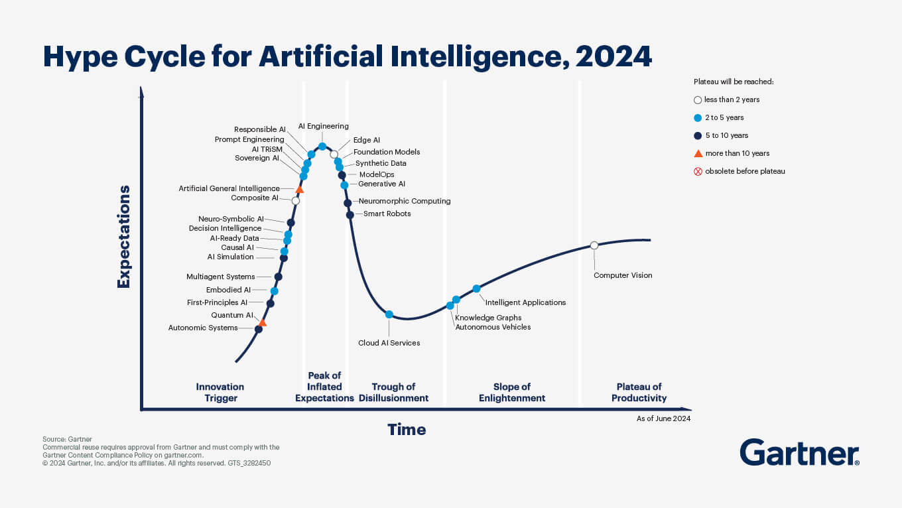
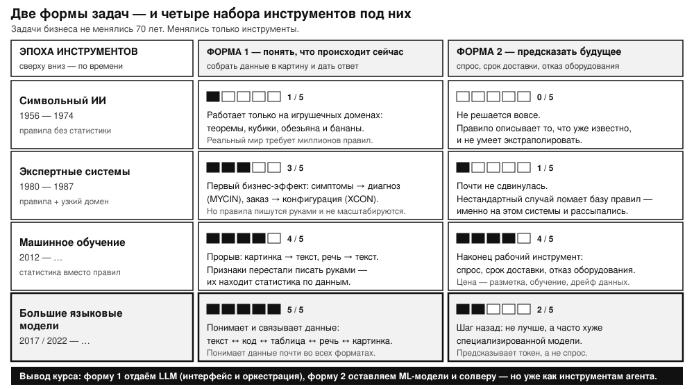

<!-- _class: divider -->

# Вступление

Знакомство · Цель курса · Условия получения зачёта

---

<!-- _class: lead profile-slide -->

  
  

    
Катрушенко Максим

    
главный специалист по машинному обучению и анализу данных в ПГК Диджитал

  

---

<!-- _class: lead -->

Вся информация по курсу - https://kamani.tech/course

---

<!-- _class: lead -->

# История ИИ: от символьных систем к генеративным моделям

### Лекция 1 из 8

**Генеративный искусственный интеллект и ИИ-агенты для транспортной логистики**
РУТ (МИИТ) · 09.04.01 Информатика и вычислительная техника

---

## Содержание лекции

| Блок  | О чём |
|---|---|
| 1 |  Символьный ИИ и первая зима |
| 2 |  Экспертные системы и вторая зима |
| 3 |  Что изменил 2012-й |
| 4 |  Трансформер и LLM |
| 5 |  Трезвость: хайп, провалы, экономика |

---

## Сквозной тезис лекции

Вся история ИТ крутится вокруг **двух целей**:

**Форма 1 — понять, что происходит сейчас.** Собрать разрозненные данные в единую картину и дать понятный ответ: устная заявка → строка в системе, симптомы → диагноз, снимок → описание.

**Форма 2 — предсказать будущее.** Спрос, срок доставки, отказ оборудования.

Бизнес хочет этого всегда.

---

<!-- _class: question -->

## Вопрос 1

**Назовите одну задачу из вашей работы или практики.**

Она помогает **понять, что происходит сейчас**, или **предсказать будущее**?

---

<!-- _class: divider -->

# Блок 1. Символьный ИИ и первая зима

###  1956–1980

---

## 1956: гипотеза, с которой всё началось

**Дартмутская конференция, 1956.** Четверо учёных во главе с Дж. Маккарти: за два месяца сделать искусственный интеллект.

Рабочая гипотеза: любую функцию разума можно **точно** описать символами и правилами.
В августе 1956 года Саймон, Ньюэлл и Шоу выкатили Logic Theorist в продакшен на компьютере JOHNNIAC в головном офисе RAND в Санта-Монике.

---

---
## Плоды гипотезы

- **Logic Theorist (1956)** — форма 1: понять, следует ли теорема из аксиом; доказала 38 теорем из 52 ([код](https://github.com/tjark-neumann/logic-theorist)).
- **General Problem Solver (1959)** — форма 1: по описанию состояния построить план «средство → цель»; состояния описывает человек вручную ([пример](https://github.com/thundergolfer/the-general-problem-solver/blob/master/gps_python/examples/monkeys.json)).

---

В августе 1956 года Саймон, Ньюэлл и Шоу выкатили Logic Theorist в продакшен на компьютере JOHNNIAC в головном офисе RAND в Санта-Монике.

---

## Прогнозы обогнали результат на 60 лет

> «Машины будут способны выполнять любую работу, которую может делать человек, в течение 20 лет.»
> — **Герберт Саймон, 1965**

> «В течение одного поколения проблема создания искусственного интеллекта будет существенно решена.»
> — **Марвин Минский, 1967**

К 1969 году DARPA вложило в ИИ **$100 млн** (≈ $800 млн в нынешних ценах).
Рынок ИИ — **$10–50 млн в год**.

---

## 1973: отчёт Лайтхилла и обвал

−90 %

Финансирование DARPA: **$100 млн → $10 млн в год**

**Почему рассыпались надежды:**

- слишком дорого и нет экономии
- комбинаторный перебор не вытягивало железо
- требовалось кодировать миллионы правил
- правила одной задачи не обобщались на другие.

Великобритания и Канада закрыли программы. Рынок сжался до **$5–10 млн в год**.

---

<!-- _class: forms -->

## Что это значит для наших двух форм

**Форма 1 — понять, что происходит сейчас** — работает только на игрушечных доменах: теоремы и учебный «мир кубиков», где робот переставляет блоки по известным правилам. Нет статистики — нет переноса на реальные данные.

**Форма 2 — предсказать будущее** — не работает вовсе. Правило описывает известное и не умеет экстраполировать.

---

<!-- _class: divider -->

# Блок 2. Экспертные системы и вторая зима

### 1980–1993

---

## Сузили задачу — и получили результат

Вместо «общего интеллекта» — правила «если-то» в одном узком дорогом домене.

**MYCIN** — точность **65 %** на **500–600 правилах**. Форма 1: по симптомам понять, есть ли у пациента инфекция ([код](https://github.com/cl-aip/mycin/blob/master/mycin.lisp)).

**XCON** — экономия **$40 млн в год**, **ROI 10x за первый год**. Форма 1: по заказу понять нужную комплектацию.

Обратная сторона XCON: со временем стало **более 6 000 правил**, написанных руками. Их актуализация съедала минимум половину эффекта проекта.  Редкие(?) исключения из правил стоили компании очень дорого.

---

## Пик 1985 — и обвал 1987–1993

**Пик:** рынок ИИ **$1–2 млрд** · японское «Пятое поколение» **$850 млн** (1982–1992) · Strategic Computing Initiative **$1 млрд** · Lisp-машины по **$100–200 тыс.**

**Дно:** продажи Lisp-машин упали на **95 % за три года** · Symbolics — банкрот · «Пятое поколение» списано с потерями **~$400 млн** · новые гранты DARPA **−80 %** · рынок **$300–500 млн**.

---

## Один и тот же сценарий дважды

---

<!-- _class: forms -->

## Что это значит для наших двух форм

**Форма 1 — понять, что происходит сейчас** — впервые дала деньги (XCON), но ценой тысяч правил, написанных руками. Не масштабируется.

**Форма 2 — предсказать будущее** — не сдвинулась. Нестандартный случай ломает базу правил, и именно на этом системы рассыпались.

---

<!-- _class: divider -->

# Блок 3. Что изменил 2012-й

###  AlexNet, ResNet, AlphaGo

---

## Три потока сошлись в одной точке

До 2012 признаки писал человек. Победители ImageNet 2010–2011: ошибка top-5 около 25–26 %.

---

## AlexNet, 30 сентября 2012

| Метрика | AlexNet | Второе место |
|---|---|---|
| Ошибка top-5 | **15.3 %** | 26.2 % |
| Параметров | 60 млн | ~тысячи |
| Глубина | 8 слоёв | 1–2 слоя |
| Обучение | 5–6 дней на 2 GPU | часы–дни |

---

Команда из Торонто: **Крижевский, Суцкевер, Хинтон**.

---

## 2015–2016: барьеры один за другим

**ResNet-152 (2015)** — 3.57 % ошибки против **~5.1 % у человека**. Идея простая: к выходу блока добавляем исходный сигнал. Самая цитируемая научная работа XXI века — **310 000+ цитирований**.

**AlphaGo (2016)** — победа над Ли Седолем. Сеть ходов обучена на **30 млн позиций** (top-1 57 %), сеть оценки позиции, MCTS, самообучение. Вложено **$20–35 млн**.

**Важная оговорка:** самообучение сработало потому, что среда замкнута — правила известны и неизменны.

---

<!-- _class: question -->

# Вопрос 2

**Ваша задача — предсказать срок доставки вагона (форма 2).**

**Для сравнения:** AlphaGo играл в го — в замкнутой среде с неизменными правилами.

Что в прогнозе срока доставки похоже на такую задачу, а что делает её реальным миром: погода, поломки, задержки, изменение расписания?

---

<!-- _class: forms -->

## Что это значит для наших двух форм

**Форма 1 — понять, что происходит сейчас** — прорыв: признаки ищет статистика, а не человек. «Из картинки — текст» впервые работает вне игрушечного домена.

**Форма 2 — предсказать будущее** — впервые появился рабочий инструмент прогноза. Цена: разметка, обучение, дрейф данных.

---

<!-- _class: divider -->

# Блок 4. Трансформер и LLM

### 2017–2025

---

## Параллельно вместо последовательно

---

## Июнь 2017: «Attention Is All You Need»

**Что дал трансформер:** все слова обрабатываются одновременно · прямая связь начала текста с концом · предсказуемое масштабирование — больше данных и параметров дают лучший результат.

**Чем платим:** матрица внимания N × N, то есть **O(N²)** по памяти и времени.

**Чего в нём нет:** механизма рассуждения. Трансформер — предсказатель следующего токена.

---

## От GPT-1 до ChatGPT

| Модель | Год | Параметров |
|---|---|---|
| GPT-1 | 2018 | 117 млн |
| GPT-2 | 2019 | 1,5 млрд |
| GPT-3 | 2020 | 175 млрд |
| GPT-3.5 / ChatGPT | 2022 | ~175 млрд |

GPT-3.5 не выросла в размере. Выросло **управление генерацией**: предобучение → дообучение с учителем → модель вознаграждения → RLHF.

**100 млн пользователей за 2 месяца** (TikTok — 9 месяцев, Instagram — 2,5 года).

---

## LLM ≠ классическая ML-модель

| | Классическая ML-модель | LLM |
|---|---|---|
| Обучение | под одну задачу, на ваших данных | общий корпус + SFT + RLHF |
| Интерфейс | фиксированные признаки → число | естественный язык → текст |
| Повторяемость | один вход — один выход | один вход — разные выходы |
| Стоимость | обучение дорого, вызов дёшев | обучение недоступно, платите за каждый вызов |

---

<!-- _class: forms -->

## Что это значит для наших двух форм

**Форма 1 — понять, что происходит сейчас** — доведена почти до предела: LLM связывает текст, код, таблицы, речь и картинки в одну картину.

**Форма 2 — предсказать будущее** — шаг назад. Модель предсказывает следующий токен, а не спрос. Специализированная модель здесь точнее.

---

<!-- _class: divider -->

# Блок 5. Трезвость

### Хайп, провалы, экономика

---

## Галлюцинации ИИ — свойство архитектуры

| Модель | Короткая суммаризация | Сложные рассуждения |
|---|---|---|
| GPT-4 | 1.8 % | 20.8 % |
| o1 | 2.4 % | 33.1 % |
| o3 | 6.8 % | 37.3 % |

Масштаб не лечит проблему: модель предсказывает **вероятный** токен, а не истинный.
Reasoning-модели дают долю убедительных, но ложных объяснений **выше**, чем простые.

---

## Мы склонны видеть разум там, где его нет

**ELIZA, 1960-е.** Джозеф Вейценбаум, мейнфрейм IBM 7094. Программа лишь переспрашивала собеседника. Автор хотел показать абсурдность — а его секретарша не могла оторваться.

Это назвали **эффектом Элизы**: мы приписываем системе больше понимания, чем в ней есть.

---

**Цикл хайпа Gartner.** Технологический триггер — 2023 год. Дальше пик завышенных ожиданий и спуск в долину разочарования.

---

## Прогнозы, которые не сбылись

**Беспилотный транспорт.** «Миллион роботакси к концу 2020» (2019). Реальность: 0 автономных машин. За десятилетие отрасль сожгла **$50–100 млрд** при суммарной выручке **до $2 млрд**.
GM списал Cruise: **свыше $10 млрд** операционных расходов, выручка менее $0,5 млрд.

**AI-радиология.** С 2016 по 2025 — **$5–7 млрд** венчурных вложений, из них **70–80 % не окупились**. Радиологи на месте, системы работают как поддержка.

---

## Схема двух форм

---

## Экономика: разрыв в 54 раза

$500–600 млрд затрат в год → $37–50 млрд выручки

Goldman Sachs: индустрии нужно **$2 трлн выручки к 2030**, чтобы оправдать вложения.
MIT/NANDA, август 2025: **95 % организаций не получают отдачи от GenAI**.

**DeepSeek V3, январь 2025:** MoE — 671 млрд параметров «на борту», **37 млрд активных на ответ**. Генерация примерно **в 80 раз дешевле**. Акции NVIDIA −17 % за день, **−$589 млрд** капитализации.

**Парадокс Джевонса:** дешевле токен → больше задач → больше суммарное потребление.

---

## AlphaFold: как выглядит попадание в цель

Определить структуру одного белка вручную — **больше десяти лет** работы и Нобелевская премия (Кендрю, 1962).

**2018** — AlphaFold впервые побеждает на CASP. **2020** — AlphaFold2 достигает точности, сопоставимой с экспериментальными методами. **2022** — открытая база **более 200 млн структур**.

Не чат-бот. Не AGI. Форма 1: понять, как устроен белок, по его последовательности аминокислот → трёхмерной структуре. Для этой узкой задачи — отдельное машинное обучение.

---

<!-- _class: forms -->

## Что это значит для наших двух форм

Обвалы акций крупных компаний били по обещаниям.

Обе задачи никуда не делись: бизнес по-прежнему хочет **понимать, что происходит сейчас**, и **предсказывать будущее**. Отменяется ровно одно предположение — **что одна универсальная модель закроет обе сразу**.

---

<!-- _class: divider -->

# Практика

###  демо и задание

---

## Возвращаемся к схеме во второй раз

---

## Отсюда — архитектура вашего агента

**LLM берёт форму 1:** понять заявку на естественном языке, выбрать инструмент, собрать ответ, объяснить решение.

**ML-модель и солвер остаются на форме 2 и на точности:** прогноз срока и спроса, маршрутизация, распределение вагонов.

LLM не считает оптимальный маршрут и не пишет SQL. Она **вызывает** того, кто это умеет.

Это ровно та система, которую вы соберёте за восемь практик.

---

<!-- _class: question -->

# Вопрос 3

**Какую часть формы 1 вы отдадите LLM, а какую часть формы 2 — модели или солверу?**

---

Код практики - a6c9a132

---